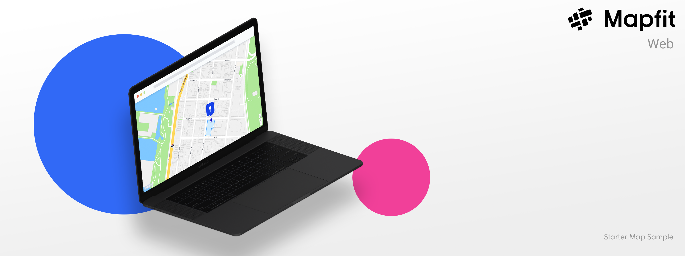

# Starter Map for Web
A simple starter map sample project to get you started with Mapfit maps!

For further documentation, please visit our [Javascript](https://mapfit.com/developers/javascript) page.

## Samples
[Single Point Map](https://github.com/mapfit/starter-map-web-sample/blob/master/single-point-map-example.html) - A simple example showing how you can place a marker on a map using either lat/lng coordinates or a geocoded address.

More samples coming soon

## Setup your map
You must declare the following stylesheets and scripts on your page to successfully render your maps.
```html
<link href="http://cdn.mapfit.com/v2-2/assets/css/mapfit.css" rel='stylesheet' />
<script src="https://cdn.mapfit.com/v2-2/assets/js/tetragon.js"></script>
<script src="http://cdn.mapfit.com/v2-2/assets/js/mapfit.js"></script>
```

Next you must initiate the map so that you can customize and add markers to it.
##### DRAW YOUR MAP
```js
let map = mapfit.MapView('mapfit', {theme: 'day'});
map.drawMap();
```

##### OPTIONAL ZOOM LEVEL CONTROLS
```js
map.setZoom(18);
map.setMaxZoom(20);
map.setMinZoom(14);
```

## Methods
Below you will find a list of example methods which will allow you to add markers, use custom icons, and track click events.

##### ADD A MARKER CALLED "myLatLngMarker" VIA LAT/LNG COORDINATES
```js
position = mapfit.LatLng([40.7461904, -73.988579])
myLatLngMarker = mapfit.Marker(position)
map.setCenter(position)
map.addMarker(myLatLngMarker);
```


##### ADD PLACE INFO TO YOUR MARKER
```js
let placeInfo = mapfit.PlaceInfo();
placeInfo.setTitle('Citi Bike');
placeInfo.setDescription('<p>Broadway & West 29th St)</br>Bikeshare</p>');
myLatLngMarker.setPlaceInfo(placeInfo);
```


##### ADD A MARKER CALLED "myAddressMarker" VIA GEOCODER
Note: All geocoder related requests require an API KEY. Visit our [Get Started](https://mapfit.com/getstarted) page to get yours today.
```js
myAddressMarker = mapfit.Marker()
myAddressMarker.address = "119 West 24th street, New York, NY, 11001"
map.addMarker(myAddressMarker);
```


##### SET A CUSTOM ICON FOR A MARKER
```js
let myCustomIcon = mapfit.Icon();
myCustomIcon.setIconUrl('http://cdn.mapfit.com/v2-2/assets/images/markers/custom/example-custom-pin.png');
myCustomIcon.setWidth(58);
myCustomIcon.setHeight(65);
myAddressMarker.setIcon(myCustomIcon);
```


##### TRACK MARKER CLICKS
```js
myLatLngMarker.on('click', function(e) {
  console.log('marker click')
})
```
